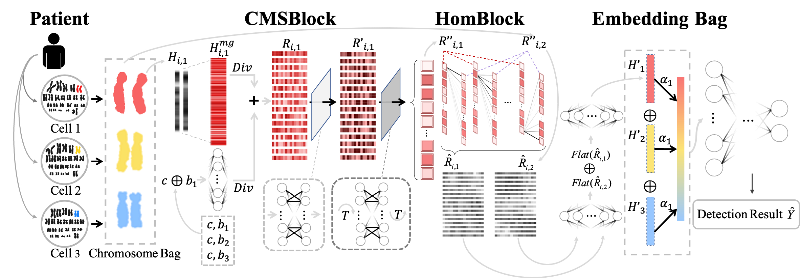

# HomNet: Chromosomal Structural Abnormality Diagnosis by Homologous Similarity

[Juren Li](jrlee@zju.edu.cn)$^{1\bullet}$,
[Fanzhe Fu](ffanz@zju.edu.cn)$^{1\bullet}$,
[Ran Wei](ranwei@diagens.com)$^2$,
[Yifei Sun](yifeisun@zju.edu.cn)$^1$,
[Zeyu Lai](jerrylai@zju.edu.cn)$^1$,
[Ning Song](ningsong@diagens.com)$^2$,
[Xin Chen](xin.21@intl.zju.edu.cn)$^3$,
[Yang Yang](yangya@zju.edu.cn)$^{1*}$. ($^\bullet$ Equal contribution; $^*$ Correspondence)

$^1$ College of Computer Science and Technology, Zhejiang University

$^2$ Hangzhou Diagens Biotechnology Co., Ltd., China

$^3$ Zhejiang University-University of Illinois Urbana-Champaign Institute

----

This repository provides the code of "Chromosomal Structural Abnormality Diagnosis by Homologous Similarity", which is accepted by the **KDD'24** ADS track (20\% acceptance rate).

## HomNet

This work proposes a method for diagnosing chromosomal structural abnormalities by leveraging homologous similarity. By aligning homologous chromosomes and considering information from multiple pairs simultaneously.


## Requirements
The recommened requirements for HomNet are specified as follow:
- python==3.8
- torch==1.8.1
- numpy==1.24.4
- scikit-learn==1.3.0
- einops==0.6.1

The dependencies can be installed by:

``pip install -r requirements.txt ``


## Dataset
We recommend using HomNet on real chromosome datasets. 
Due to the sensitive nature of the chromosomal data, there are few openly available datasets containing chromosomal structural abnormalities. 
Here is a publicly available chromosome [dataset](https://ieeexplore.ieee.org/document/906069), however, it only consists of normal chromosomes.

## Run
You can pretrain HomNet by ``pretrain.py`` and fine tune the pretrained model by ``fine_tune.py``.

Also we provide a demo for pretrain ``demo_notebook/pretrain.ipynb`` and a demo for fine tune ``demo_notebook/fine_tune.ipynb``, you can use randomly generated dataset to run the proposed HomNet.

**pretrain:**

```
python pretrain.py\
    --batch_size 512\
    --cell_num 5\
    --device cuda:0\
    --drop_out 0.5\
    --early_stop 5\
    --emb_dim 128\
    --eval_train 0\
    --frozen 0\
    --ft 0\
    --log 0\
    --lr 0.001\
    --l2 0.001\
    --max_iter 50000\
    --n_head 4\
    --n_layer 2\
    --name HomNet\
    --seq_size 8\
    --show_iter 500\
    --warmup_iter 500\
    --with_band 1\
    --vec_dim 64
```

**fine tune:**
```
python fine_tune.py\
    --batch_size 512\
    --cell_num 5\
    --device cuda:0\
    --drop_out 0.5\
    --early_stop 5\
    --emb_dim 128\
    --eval_train 0\
    --frozen 1\
    --ft 0\
    --log 0\
    --lr 0.001\
    --l2 0.001\
    --max_iter 50000\
    --n_head 4\
    --n_layer 2\
    --name HomNet\
    --seq_size 8\
    --show_iter 500\
    --warmup_iter 500\
    --with_band 1\
    --vec_dim 64
```
``--frozen`` should be reset according to the ``--n_layer``.

## Concate
If you have any question about the code or the paper, feel free to contact me through [email](jrlee@zju.edu.cn).

## Citation
If you find HomNet useful in your research or application, please kindly cite:
```
@inproceedings{
    juren2024chromosomal, 
    title={Chromosomal Structural Abnormality Diagnosis by Homologous Similarity}, author={Juren L, Fanzhe F, Ran W, et al.}, 
    booktitle={Proceedings of the 30th ACM SIGKDD Conference on Knowledge Discovery and Data Mining}, year={2024},
    note={Accepted}
    }
```